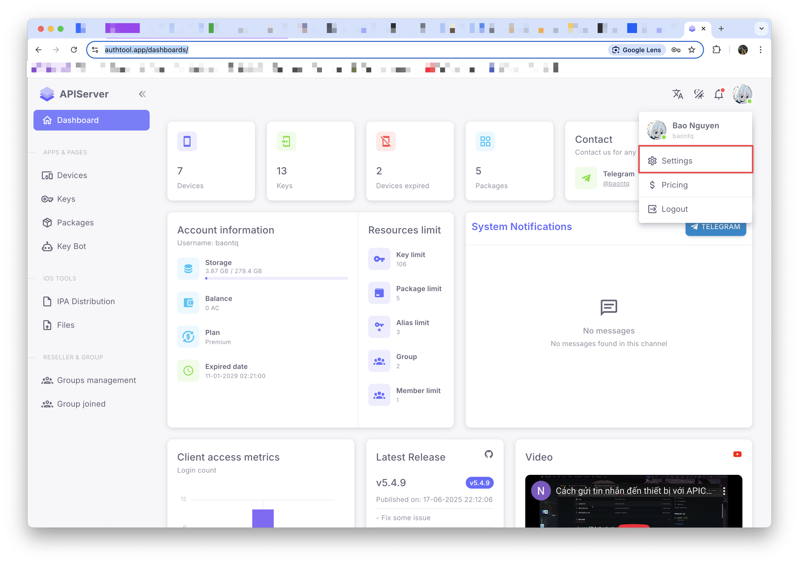
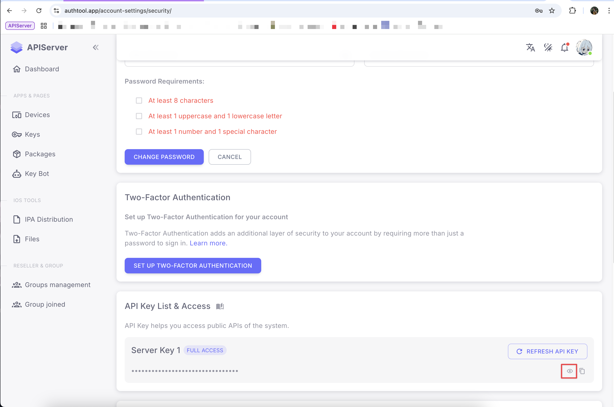

# Lấy API Key

API Key là yêu cầu bắt buộc để sử dụng tất cả các endpoint của API. Trang này sẽ hướng dẫn bạn cách lấy và sử dụng API Key.

## Bước 1: Đăng ký tài khoản

Trước tiên, bạn cần có một tài khoản để có thể tạo API Key.

1. Truy cập vào trang [đăng ký](https://authtool.app/register)
2. Điền thông tin cần thiết
3. Xác thực email
4. Đăng nhập vào hệ thống

## Bước 2: Truy cập trang thông tin tài khoản

Sau khi đăng nhập thành công vào [authtool.app](https://authtool.app), bạn cần truy cập vào trang thông tin tài khoản để lấy API Key.



## Bước 3: Tìm và copy API Key

Trong trang thông tin tài khoản, bạn sẽ thấy API Key của mình:



:::warning Quan trọng

- API Key này là **duy nhất** và **bí mật** của bạn
- **Không chia sẻ** API Key với bất kỳ ai
  :::

## Bước 4: Sử dụng API Key trong request

Sau khi có API Key, bạn cần thêm nó vào header của mọi API request với tên `x-api-key`.

### Ví dụ với cURL

```bash
curl -X GET "https://api.authtool.app/v1/endpoint" \
  -H "x-api-key: YOUR_API_KEY_HERE" \
  -H "Content-Type: application/json"
```

### Ví dụ với JavaScript (Fetch API)

```javascript
const response = await fetch("https://api.authtool.app/v1/endpoint", {
  method: "GET",
  headers: {
    "x-api-key": "YOUR_API_KEY_HERE",
    "Content-Type": "application/json",
  },
});
```

### Ví dụ với JavaScript (Axios)

```javascript
const axios = require("axios");

const response = await axios.get("https://api.authtool.app/v1/endpoint", {
  headers: {
    "x-api-key": "YOUR_API_KEY_HERE",
  },
});
```

### Ví dụ với Python (requests)

```python
import requests

headers = {
    'x-api-key': 'YOUR_API_KEY_HERE',
    'Content-Type': 'application/json'
}

response = requests.get('https://api.authtool.app/v1/endpoint', headers=headers)
```

### Ví dụ với PHP (cURL)

```php
<?php
$apiKey = 'YOUR_API_KEY_HERE';
$url = 'https://api.authtool.app/v1/endpoint';

$ch = curl_init();
curl_setopt($ch, CURLOPT_URL, $url);
curl_setopt($ch, CURLOPT_RETURNTRANSFER, true);
curl_setopt($ch, CURLOPT_HTTPHEADER, [
    'x-api-key: ' . $apiKey,
    'Content-Type: application/json'
]);

$response = curl_exec($ch);
$httpCode = curl_getinfo($ch, CURLINFO_HTTP_CODE);
curl_close($ch);

echo $response;
?>
```

### Ví dụ với PHP (Guzzle HTTP Client)

```php
<?php
use GuzzleHttp\Client;

$client = new Client();
$response = $client->get('https://api.authtool.app/v1/endpoint', [
    'headers' => [
        'x-api-key' => 'YOUR_API_KEY_HERE',
        'Content-Type' => 'application/json'
    ]
]);

$data = $response->getBody()->getContents();
echo $data;
?>
```

:::note Lưu ý

- Thay thế `YOUR_API_KEY_HERE` bằng API Key thực tế của bạn
- Header `x-api-key` phải được thêm vào **mọi request** đến API
- Nếu không có header này hoặc API Key không hợp lệ, request sẽ trả về lỗi 401 Unauthorized
  :::
