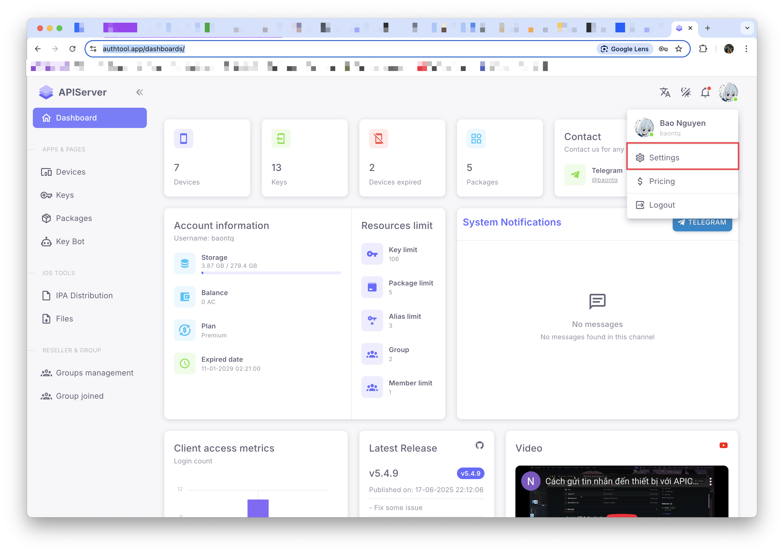
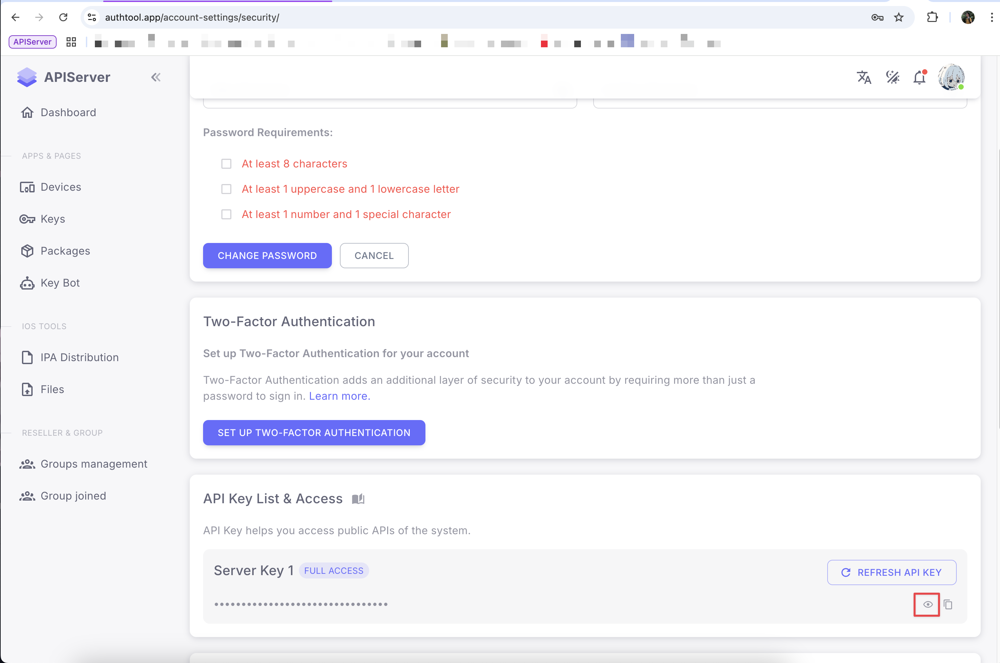

# Getting API Key

API Key is a required credential to use all API endpoints. This page will guide you through how to obtain and use an API Key.

## Step 1: Register an Account

First, you need to have an account to create an API Key.

1. Visit the [registration page](https://authtool.app/register)
2. Fill in the required information
3. Verify your email
4. Log in to the system

## Step 2: Access Account Information Page

After successfully logging in to [authtool.app](https://authtool.app), you need to access the account information page to get your API Key.



## Step 3: Find and Copy API Key

In the account information page, you will see your API Key:



:::warning Important

- This API Key is **unique** and **secret** to you
- **Do not share** your API Key with anyone
  :::

## Step 4: Use API Key in Requests

After obtaining your API Key, you need to add it to the header of every API request with the name `x-api-key`.

### Example with cURL

```bash
curl -X GET "https://api.authtool.app/v1/endpoint" \
  -H "x-api-key: YOUR_API_KEY_HERE" \
  -H "Content-Type: application/json"
```

### Example with JavaScript (Fetch API)

```javascript
const response = await fetch('https://api.authtool.app/v1/endpoint', {
  method: 'GET',
  headers: {
    'x-api-key': 'YOUR_API_KEY_HERE',
    'Content-Type': 'application/json'
  }
})
```

### Example with JavaScript (Axios)

```javascript
const axios = require('axios')

const response = await axios.get('https://api.authtool.app/v1/endpoint', {
  headers: {
    'x-api-key': 'YOUR_API_KEY_HERE'
  }
})
```

### Example with Python (requests)

```python
import requests

headers = {
    'x-api-key': 'YOUR_API_KEY_HERE',
    'Content-Type': 'application/json'
}

response = requests.get('https://api.authtool.app/v1/endpoint', headers=headers)
```

### Example with PHP (cURL)

```php
<?php
$apiKey = 'YOUR_API_KEY_HERE';
$url = 'https://api.authtool.app/v1/endpoint';

$ch = curl_init();
curl_setopt($ch, CURLOPT_URL, $url);
curl_setopt($ch, CURLOPT_RETURNTRANSFER, true);
curl_setopt($ch, CURLOPT_HTTPHEADER, [
    'x-api-key: ' . $apiKey,
    'Content-Type: application/json'
]);

$response = curl_exec($ch);
$httpCode = curl_getinfo($ch, CURLINFO_HTTP_CODE);
curl_close($ch);

echo $response;
?>
```

### Example with PHP (Guzzle HTTP Client)

```php
<?php
use GuzzleHttp\Client;

$client = new Client();
$response = $client->get('https://api.authtool.app/v1/endpoint', [
    'headers' => [
        'x-api-key' => 'YOUR_API_KEY_HERE',
        'Content-Type' => 'application/json'
    ]
]);

$data = $response->getBody()->getContents();
echo $data;
?>
```

:::note Note

- Replace `YOUR_API_KEY_HERE` with your actual API Key
- The `x-api-key` header must be added to **every request** to the API
- If this header is missing or the API Key is invalid, the request will return a 401 Unauthorized error
  :::
